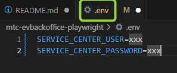
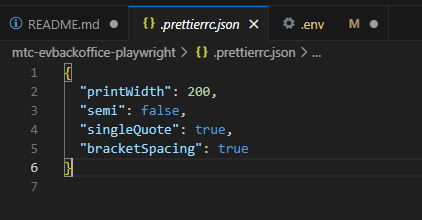
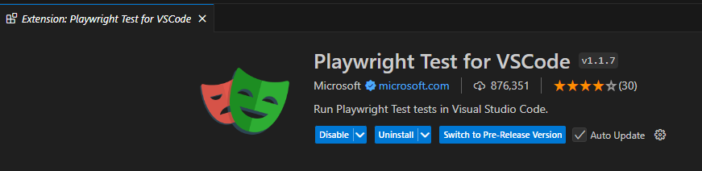
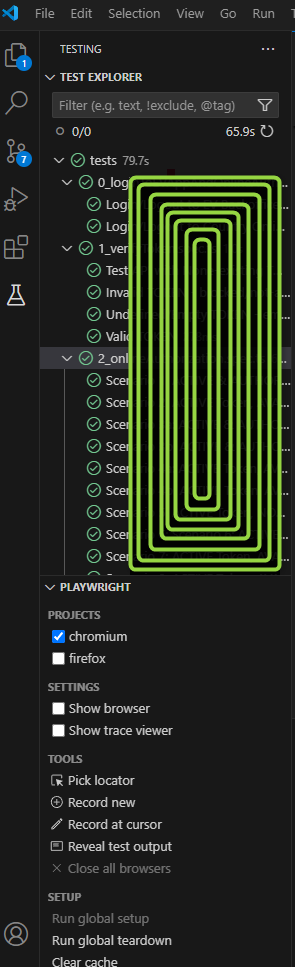

## Short intro for VISITORS - thank you for visiting me repository

### This is just demo presentation and combination of Manual Tests - folder documentation</br>

# Remember that this automation will never work because of just Example.

### remember to navigate to:
```javascript

1. You should read instructions in README.md file 
2. Presenting my test skillset. Navigate to folder: 'documentation' to extract what You want to see and read Test Plan and Manual Tests Scenarios.
when You are in 'documentation' folder please click  blue linked 'View raw' - then will download excel file to your local machine

documentation/Functionality of 'Like' - SAMPLE_ID-123.xlsx

3. If You want to read Test Plan, navigate to documentation/Test Plan SAMPLE test plan.pdf
Remember to click gray button "More Pages" on the bottom of screen. Or You can download whole file using downloading icon.

4. You can also read about my very basic and simple Automation ideas for Test Scenarios and Test Cases navigating here:
documentation/read-API-testing/API-test.md

```

### I know that .ENV file should be in .gitignore but this is just demo repo and you are able to see .env 
```javascript
.env
```

### remember to clone repo or You can download single files one by one (read 'How to start' section below)

---


### How to start:

1. Install [Node JS](https://nodejs.org/en/download/)
2. Clone the project to your local machine

```javascript
git clone
```

3. In the terminal go to the folder with project and install all dependencies:

```javascript
npm install
```

4. Remember to create your own branch - branch should be created always from Master, and remember to never merge to Master without Pull Request or team consultation.

5. How to run in command line:

a) for DEV env we got domain: https://os-tst.mtc.nl => use terminal command line:

```javascript
DEV=1 npx playwright test --ui
```

b) default for TST env, works like: npx playwright test --project=chromium --ui

```javascript
npm run test
```

6. Write Your scripts in folder "tests" ("test-results" is auto-generated during test execution and contain records, screenshots etc).

7. How to debug by test-results folder:

a) execute Trace option from config by command line f.ex:</br>

```javascript
npx playwright show-trace test-results/7_overrideToken-API---Over-c184e-rride-page-highest-priority-chromium/trace.zip
```

</br>
b) following Video record in "test-results" folder</br>

c) following Screenshot in "test-results" folder</br>

d) execute command line to see html report:</br>

```javascript
npx playwright show-report
```
</br>
-------------------------------------------------------


### 1. Test with different users may have different results, that's why "testUser" should be avaliable for all of team members to test app behaviour.</br> 
In this Test automation for "EV Backoffice" and "Online Country Auth", we got global testUser for all team members, so do not hide credentials in ".env"
### 2. For run Timers in Service Center credentials are hidden in .env, so how to build Your own data:
Create .env file in project root and fill out your credentials:
```javascript
SERVICE_CENTER_USER=xxx
SERVICE_CENTER_PASSWORD=xxx
```

## Remember, Your User account have to have required role in Service Center

### 3. Important: Sometimes some tests have to <b>re-run triple</b> to set correct starting-state of application, derfor pay attention to read test descriptions into test.spec.files

-------------------------------------------------------


# Extras:

---

1. 
### To use simple code formatter have to install Prettier extention in vscode


```javascript
{
  "printWidth": 200,
  "semi": false,
  "singleQuote": true,
  "bracketSpacing": true
}
```


### Prettier code formatter in .prettierrc.json works automatically. </br>
Here You can learn about prettier config: https://prettier.io/docs/en/options

---

2. 
### To test some test-cases You have to be logged through VPN

---

3. 
###  For maximize TE (Testers Experience) recommend to use VSCode extention



Which can help to execute tests inside VSCode
